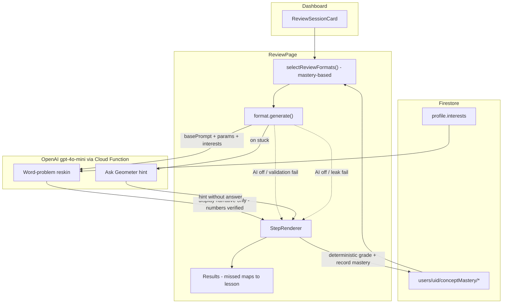

# Geometer — Phase 2 PRD

## Vision

Phase 1 shipped a hand-built, learn-by-doing geometry course with no AI. Phase 2 adds a **personalized Review Session** at the top of the dashboard that uses spaced-retrieval to bring back concepts a learner has not yet mastered or has not practiced in a while.

The session itself — *what to review* and *what to revisit afterward* — is **rule-based**, because a per-concept mastery score and a missed-concept-to-lesson lookup are more reliable and predictable than a model. AI is reserved for the two jobs the research actually shows it is good at, and where ground truth still protects correctness:

- **Word-problem reskinning (engagement):** AI wraps a deterministic template question in an interest-themed word problem. The numbers and the answer remain template-generated and deterministically graded — AI only writes narrative.
- **Ask Geometer — struggle-grounded hints that withhold the answer (guidance):** when a learner is stuck on a You-do question, they tell Geometer in their own words what they're stuck on, and AI returns a single guiding hint grounded in both the structured step state and that stated struggle, forbidden from revealing the final number. This is a single-round exchange (one struggle, one hint), not a conversation.

AI **never generates the underlying questions, never picks what to review, and never grades answers.** This keeps every reviewed problem mathematically correct and on-standard, regardless of model behavior.

**Phase 2 hard rule (from** `outline.txt`**):** The Phase 1 app must keep working with AI turned off. With AI unavailable, reskinned word problems fall back to the plain template prompt and Ask Geometer hints fall back to the hand-written Phase 1 hints — the full session still runs.

**Scope (confirmed):**

- Review covers the **numeric/computational lessons only**: `right-triangles`, `non-right-triangles`, `distance-coordinate-plane`.
- The drag/geometry lessons (`transformations`, `congruence-similarity`) are **out of scope** for Phase 2 review formats (see Out of Scope).
- AI provider: **OpenAI** `gpt-4o-mini`**, called through a secure Firebase Cloud Function proxy** (the OpenAI API key stays server-side and is never shipped in the client bundle).


## Why This Design (grounded in `brainlift.md`)

- **Spaced repetition** beats modular review for retention; resurface unmastered concepts sooner (Insight 1; Knowledge Tree 1.1). The Review Session is the delivery mechanism, scheduled by a rule-based per-concept mastery score (mastery level + how long since the concept was last reviewed).
- **Retrieval practice / learning is application, not recognition** (Insight 3). Review presents *new numbers* on the same concept, forcing recall rather than memorized answers.
- **AI must be grounded and truth-checked** (Insight 2; Knowledge Tree 3.4). LLM-generated items drift in difficulty and duplicate themselves, so we never ask the model for problems — numbers come from curated parameter sets and answers from a ground-truth solver. AI only rewrites the *narrative*.
- **Interest-customized word problems boost engagement without hurting performance** (Knowledge Tree 3.4 / EDUMATH), *provided each item is verified*. Reskinning satisfies the verification requirement by leaving the math entirely deterministic.
- **Hints that guide instead of giving the answer build durable skill; answer-giving AI vaporizes it** (Knowledge Tree 3.2 and 3.3; Insight 2). Ask Geometer hints are gated to withhold the final number, verified against the known ground-truth answer, and made sharper by asking the learner what they're stuck on so the nudge targets the real gap instead of guessing.


## Persona and User Stories

Same persona as Phase 1 (8th graders, hands-on, self-paced).

- As **Jill**, who keeps mixing up area and perimeter, I want a review that resurfaces the exact problem types I got wrong so I can fix my weak spots. *(Resolves the Phase 1 deferred story.)*
- As **Johnny**, who finished a lesson last week, I want a quick daily review that brings back concepts I haven't touched recently so they stick.
- As **Sally**, who is ahead, I want the review to skip what I've mastered and challenge me on the rougher concepts with fresh numbers.
- As **Robert**, after a review I want the app to tell me which lesson to revisit, so I know where to focus instead of guessing.
- As **Maria**, who is bored by abstract triangles, I want review questions framed around things I like (basketball, video games) so practice feels relevant. *(Word-problem reskinning.)*
- As **Devon**, who gets stuck and is tempted to give up, I want to tell Geometer what's confusing me and get a nudge toward the next step without being handed the answer, so I still figure it out myself. *(Ask Geometer.)*


## What AI Does vs Does Not Do


| Concern                                   | Owner                      | Mechanism                                                                                                                                                |
| ----------------------------------------- | -------------------------- | -------------------------------------------------------------------------------------------------------------------------------------------------------- |
| Which concepts/formats to review          | **Deterministic**          | Per-concept mastery score (mastery level from last-2 correctness + oldest `lastReviewedAt` first)                                                        |
| Post-session lesson recommendations       | **Deterministic**          | Each missed concept maps directly to its source `lessonId`                                                                                               |
| The actual question numbers and answer    | **Deterministic**          | Parameterized question formats with curated number sets + ground-truth solver                                                                            |
| Correctness of every answer               | **Deterministic**          | Ground-truth solver per format (integer exact-match, tolerance 0)                                                                                        |
| Word-problem narrative (the "skin")       | **AI**                     | OpenAI `gpt-4o-mini` (via Cloud Function) rewrites the template prompt as an interest-themed word problem; numbers/answer unchanged                      |
| In-session hint when stuck (Ask Geometer) | **AI**                     | OpenAI `gpt-4o-mini` (via Cloud Function) writes ONE hint grounded in step state plus the learner's stated struggle; forbidden from revealing the answer |
| Behavior when AI is unavailable           | **Deterministic fallback** | Plain template prompt instead of a word problem; hand-written Phase 1 hint instead of an Ask Geometer hint                                               |


---


## Pages and UI

**Dashboard (**`/dashboard`**) — new Review Session card.**

Insert a `ReviewSessionCard` in [src/pages/DashboardPage.tsx](src/pages/DashboardPage.tsx) between `<ProgressBar />` and `<div className="lesson-list">` (after line 41). The card:

- Shows only when the learner has at least one completed "You do" question to review (otherwise hidden or shown disabled with "Finish a lesson to unlock review").
- Displays a title ("Daily Review"), a one-line summary (e.g. "5 concepts ready · 2 need work"), and a **Start review** button.

**Review Session (full-screen, outside the tab bar) — new route** `/review`**.**

A new `ReviewPage` (modeled on [src/components/lesson/LessonView.tsx](src/components/lesson/LessonView.tsx)) that:

1. Runs **rule-based** selection, then renders a sequence of generated questions through the existing `StepRenderer`.
2. For each question, requests an AI word-problem reskin (themed by the learner's saved interests); if it fails, shows the plain template prompt.
3. Offers an **Ask Geometer** affordance on each question; tapping it opens a small free-text prompt ("What are you stuck on?"). On submit it requests a single hint grounded in the learner's struggle text (falls back to the hand-written hint). It is a single round — the input closes after the hint is shown; there is no back-and-forth.
4. Tracks right/wrong per question in-session and persists attempts.
5. Ends on a **Results screen** showing per-concept right/wrong and **rule-based** lesson recommendations (missed concept → its lesson) with **Revisit** links to `/lesson/:lessonId`.

**Account (**`/account`**) — new interests field.**

Add an **interests** input (a small set of tags/chips, e.g. "basketball", "video games", "cooking") to [src/pages/AccountPage.tsx](src/pages/AccountPage.tsx), persisted on the user profile. Empty interests are valid — reskinning then uses neutral, varied themes.

---


## Functional Requirements

FRs are ordered by build priority. Each is a checkpoint: complete it, verify acceptance criteria, then move on. The first three FRs deliver a **complete, shippable review session with no AI** (rule-based selection and recommendations). FR-4 layers the two AI enhancements (word-problem reskinning, Ask Geometer struggle-grounded hints) on top as pure additions, each with a deterministic fallback.

---


### FR-1: Concept Mastery Tracking (Priority 1)

**Goal:** Persist a per-concept mastery record (derived from answer correctness) so the system knows which concepts each learner has mastered and when each was last reviewed. We track only mastery and recency — **not** wrong answers, per-question answer logs, attempt counts, or per-question attempt timestamps.

**Scope:**

- New Firestore subcollection `users/{uid}/conceptMastery/{conceptId}` where `conceptId = "${lessonId}__${stepId}"` (the stable Phase 1 slugs; this is the "lesson # and step #" identifier).
- Record **only "You do" steps** in the three in-scope lessons. "We do" and "I do" steps are never recorded. You-do steps are identified by a `YOU_DO_STEPS` registry (lessonId → stepIds) and/or `step.tag === 'You do'`.
- Each document is a **per-concept mastery record** (one doc per concept, updated in place) holding the identifier, a short rolling list of recent correctness flags, and when the concept was last reviewed. We **do not** store the learner's actual answers, attempt counts, or a per-answer log.
- Writes happen on answer submission for You-do steps: push the latest correctness flag onto `recentCorrect` (capped at the last 2, newest last) and set `lastReviewedAt`. This requires instrumenting the answer-submit path (today wrong answers stay local in step components and only correct answers advance via `setStep`) — but only the **correctness** of each attempt is recorded, never the answer itself.

**Document schema (**`ConceptMastery`**):**

```ts
interface ConceptMastery {
  lessonId: string;            // e.g. "right-triangles"
  stepId: string;              // e.g. "q1-hypotenuse"  (You-do step)
  recentCorrect: boolean[];    // last 2 attempt-correctness flags, newest last, capped at 2
  lastReviewedAt: number;      // epoch ms of the most recent review of this concept
}
```

**Mastery level (last-2 rule):** derive a level from `recentCorrect` — 2 correct → `mastered`, exactly 1 correct → `learning`, otherwise → `need-review`.

**Firestore rules:** add a `match /users/{userId}/conceptMastery/{conceptId}` block in [firestore.rules](firestore.rules) — owner read/delete; create/update validated with `hasOnly([...])` and type checks, mirroring the existing `progress` rule.

**Out of scope for this FR:** AI, the review UI, question formats.

**Acceptance criteria:**

- Answering a You-do question (right or wrong) writes/updates the matching `conceptMastery` doc; non-You-do steps never write.
- `recentCorrect` holds at most the last 2 correctness flags (newest last) and `lastReviewedAt` reflects the latest review; no answer values, attempt counts, or per-answer log are persisted.
- Mastery level derived from `recentCorrect` follows the last-2 rule (2 → `mastered`, 1 → `learning`, 0 → `need-review`).
- Rules reject writes from other users and writes with unexpected keys/types.

> **Checkpoint:** Verify persistence in the Firestore console before FR-2.

---


### FR-2: Question Format System (Priority 2)

**Goal:** Convert the Phase 1 You-do problems into **parameterized question formats** that plug in numbers and have a deterministic ground-truth answer — so review questions are always fresh and always correct, with no AI involved.

**Scope:**

- New types in `src/types/review.ts` and a catalog in `src/content/reviewFormats.ts`.
- A `QuestionFormat` is a template derived from a Phase 1 You-do question: a prompt with placeholders, a parameter spec, and a pure **solver** that computes the ground-truth answer(s) from the chosen parameters.
- **Parameter generation** supports the three modes the design calls for:
  - **Curated set** — pick from a list of valid tuples (e.g. Pythagorean triples and their integer multiples). Required wherever integer answers depend on the inputs.
  - **Fully random** — sample integers from a range with constraints.
  - **Partially random** — fix some values, randomize others.
- A format **generates a concrete question** by producing an ephemeral object shaped like a `LessonStep` (prompt + `triangle`/`graph` + computed `answer`/`inputs`), so the existing [src/components/lesson/StepRenderer.tsx](src/components/lesson/StepRenderer.tsx) renders and grades it with no new UI.
- All answers stay **integer, exact-match (tolerance 0)** to match Phase 1 grading.

**Type sketch:**

```ts
interface QuestionFormat {
  formatId: string;                 // stable id, referenced by selection + reskinning
  lessonId: string;                 // concept this reviews
  sourceStepId: string;             // Phase 1 step it derives from
  label: string;                    // human concept label, e.g. "Find the hypotenuse"
  generate(): GeneratedQuestion;    // plug params -> concrete, solved question
}

interface GeneratedQuestion {
  formatId: string;
  step: LessonStep;                 // ephemeral, reuses StepRenderer (holds ground-truth answer)
  params: Record<string, number>;   // the numbers plugged in
  basePrompt: string;               // plain template prompt; AI reskin replaces only the display text
}
```

**Initial format catalog (one per in-scope You-do concept, ~8 formats):**

- `right-triangles`: find hypotenuse (Pythagorean triple set), right-triangle area (legs × ½), missing leg → perimeter, missing leg → area.
- `non-right-triangles`: area from base × height, perimeter from split base + sides.
- `distance-coordinate-plane`: distance between two points (integer-delta triples), perimeter of a coordinate triangle.

**Out of scope for this FR:** AI reskinning/hints, dashboard card, results screen, drag/geometry formats.

**Acceptance criteria:**

- Each format generates a fresh question on each call with valid integer parameters.
- The solver's answer always matches a hand-verified computation for any generated params (covered by Vitest, mirroring the Phase 1 content-integrity tests).
- A generated question renders and grades correctly through `StepRenderer` with no renderer changes.

> **Checkpoint:** Verify a generated question end-to-end in a scratch route before FR-3.

---


### FR-3: Review Session Runner — Rule-Based Selection and Recommendations (Priority 3)

**Goal:** Ship the complete review session — dashboard card, runner, and results — entirely rule-based, with **no model calls**. This is the full feature; FR-4 only enriches the surface.

**Scope:**

- `ReviewSessionCard` on the dashboard (visibility/summary per the UI section).
- `/review` route + `ReviewPage` that:
  - **Selection (rule-based, mastery-driven):** read the learner's `conceptMastery` and select **N formats** (default 5–8) using a deterministic score that prioritizes by **mastery level first** (`need-review` over `learning` over `mastered`) and, within the same level, the concept whose `lastReviewedAt` is **oldest** (longest since reviewed). A never-practiced concept counts as `need-review` (max priority) once the learner has completed its source lesson.
  - Generates one concrete question per selected format and renders it through `StepRenderer` using the plain `basePrompt`.
  - Records each attempt via FR-1.
  - **Recommendations (rule-based):** the **Results screen** shows per-concept right/wrong and, for any concept missed in the session, a **Revisit** link to its source `/lesson/:lessonId` (missed concept → `format.lessonId`, deduplicated and ordered by course position).
- Expose two small seams so FR-4 can decorate without rewrites: a per-question `renderPrompt(question)` (returns `basePrompt` until reskinning exists) and a `getHint(question, attempts)` (returns the hand-written hint until Ask Geometer struggle-grounded hints exist).

**Out of scope for this FR:** any model calls.

**Acceptance criteria:**

- From the dashboard, a learner can start a review, answer a sequence of fresh questions, and reach a results screen.
- Lower-mastery (`need-review`, then `learning`) and longer-since-reviewed concepts appear preferentially.
- Each concept missed in the session produces a "Revisit Lesson X" link that opens the correct lesson.
- Attempts are persisted (FR-1) during the session.

> **Checkpoint:** This is a shippable, AI-off milestone (satisfies the `outline.txt` AI-off rule on its own). Verify before FR-4.

---


### FR-4: AI Enhancements via OpenAI behind a Cloud Function Proxy (Priority 4)

**Goal:** Add the two AI features — **word-problem reskinning** and **Ask Geometer (struggle-grounded hints)** — as pure additions on top of the working FR-3 session, each grounded in deterministic state and each with a fallback so the session is unaffected when AI is off.

**Setup (shared):**

- Add a **Firebase Cloud Function** (callable, Firebase Functions v2) that proxies requests to OpenAI `gpt-4o-mini`. The OpenAI API key is stored server-side as a Firebase secret (`OPENAI_API_KEY`) and is **never** shipped in the client bundle. Default model: `gpt-4o-mini`; consider Remote Config for the model name.
- The callable **enforces Firebase App Check** (`enforceAppCheck`) so only the app can invoke it. App Check is a **ship blocker** for the AI features (prevents quota/abuse of the proxy).
- The client invokes the function with `httpsCallable`; it requests **structured JSON output** for both calls.
- Cloud Functions require the Firebase **Blaze plan** to deploy.
- New profile field `interests: string[]` (FR-5 / Account UI), passed into reskin prompts.


#### 4a. Word-problem reskinning

- For each generated question, call the Cloud Function (which calls `gpt-4o-mini`) with: the `basePrompt`, the `params` (the numbers in play), the concept `label`, and the learner's `interests`. Ask it to rewrite the prompt as a short word problem on the **same quantities**, in the learner's theme.
- **Grounding / correctness:** the model returns **only display narrative**. The graded answer stays the solver's `answer` on the underlying `step`; the learner still types the same numeric answer. The model is instructed not to change, add, or omit any quantity and not to state the answer.
- **Light validation:** verify every number in `params` appears in the returned text and no extra "answer-shaped" number is introduced; on validation failure, fall back to `basePrompt`.
- **Fallback:** any error, timeout, or App Check failure → render `basePrompt`. (Optionally pre-fetch reskins for the whole session up front to hide latency.)


#### 4b. Ask Geometer (struggle-grounded hint)

- An **Ask Geometer** button on each review question (and, optionally, reused in `LessonView` You-do steps). On tap, show a small free-text box prompting "What are you stuck on?". On submit, call the Cloud Function (which calls `gpt-4o-mini`) with the step state (concept, the actual numbers, the learner's latest wrong entry if any) **plus the learner's struggle text**, and request a single guiding hint targeted at that struggle.
- **Single round:** one struggle in, one hint out. No conversation history is kept, and the input closes once the hint is shown. If the learner submits empty struggle text, degrade gracefully to today's behavior (hint from the problem + latest wrong entry only).
- **Withhold-the-answer guarantee (per brainlift 3.2/3.3):** the prompt forbids revealing the final value or a full worked solution; the response is **post-filtered to reject any hint string containing the ground-truth answer** (which we know from the solver). If the check fails, retry once, then fall back to the hand-written Phase 1 hint.
- **Untrusted free-text input:** the struggle text is learner-supplied and must be treated as untrusted. The prompt instructs the model to ignore any embedded instruction to reveal the answer, change the task, or break the withhold rule (e.g. "just tell me the answer"). The answer-leak post-filter (`hintLeaksAnswer`) is the non-negotiable backstop regardless of what the text contains.
- Hints are **opt-in** (the learner taps for them and describes their struggle), consistent with brainlift 3.3's finding that the benefit appears when learners choose to engage.
- **Fallback:** any error/timeout/App Check failure → show the hand-written hint already authored on the source step's `feedback.hint`.
- **Implied service change:** `getSocraticHint(question, { lastWrongAnswer, struggle })` gains a `struggle: string`, and `buildHintPrompt` appends a sanitized struggle line; the leak filter and retry/fallback logic are otherwise unchanged.

**Out of scope for this FR:** AI-generated questions or numbers, AI grading, AI selection, AI recommendations, multi-turn chat tutor (Ask Geometer is single-round only).

**Acceptance criteria:**

- A reskinned question reads as an interest-themed word problem, preserves the same numbers, never states the answer, and is graded identically to the plain question.
- Reskin validation failure or AI-off cleanly shows the plain `basePrompt`; the session is otherwise identical.
- Asking Geometer with a stated struggle returns a single guiding hint targeted at that struggle that does **not** contain the answer; an answer-revealing struggle prompt is ignored and still does not leak; with AI off it shows the hand-written hint.
- App Check is enabled on the deployed app.

> **Checkpoint:** Verify reskinning, hints, and both fallback paths on the deployed app.

---


### FR-5: Testing, Mobile, and Deployment (Priority 5)

**Goal:** Keep Phase 1 guarantees intact and verify the new flow on the deployed app.

**Scope:**

- **Account interests UI:** the `interests: string[]` field editor in [src/pages/AccountPage.tsx](src/pages/AccountPage.tsx), persisted to the profile.
- Vitest coverage for: every format solver (ground-truth correctness across generated params), the **mastery-based selection ranking** (mastery level ordering `need-review` > `learning` > `mastered`, with oldest `lastReviewedAt` first as the tiebreak), the missed-concept → lesson mapping, the reskin **number-preservation validator**, and the hint **answer-leak filter** — including the filter exercised with learner struggle text present and an **adversarial struggle** (e.g. "just tell me the answer") that must still not leak the ground-truth value.
- `ReviewSessionCard`, `ReviewPage`, and results screen responsive on phone-sized viewports; reuse Phase 1 styles in [src/styles/global.css](src/styles/global.css).
- Confirm Phase 1 lessons and the full review session still work with AI disabled (AI-off acceptance from `outline.txt`).
- Deploy to the existing Firebase Hosting target.

**Acceptance criteria:**

- All format solvers pass exact-match tests; the reskin validator rejects prompts that drop/alter numbers; the hint filter rejects hints containing the answer.
- Review flow works on mobile and with AI turned off (plain prompts + hand-written hints).
- No regression in Phase 1 lesson, streak, or leaderboard behavior.

> **Checkpoint:** Phase 2 complete.

---


## Data Model and Schemas

**New Firestore subcollection (per user):**

```
users/{uid}/conceptMastery/{lessonId__stepId}  ->  ConceptMastery
```

`ConceptMastery` as defined in FR-1 (per-concept mastery record: `recentCorrect` last-2 flags + `lastReviewedAt`; no answers, attempt counts, or per-answer log). This is additive — Phase 1's `users/{uid}/data/progress` and `leaderboard/{uid}` are unchanged.

**Profile change (**`users/{uid}/data/profile`**):** add `interests: string[]` to `UserProfile`. The [firestore.rules](firestore.rules) `profile` block currently uses `hasOnly(['displayName', 'photoURL'])` — extend it to allow an optional `interests` list (with a size cap and string-element checks).

**New static content / services (bundled TS, like Phase 1 lessons):**

- `src/types/review.ts` — `QuestionFormat`, `GeneratedQuestion`, selection + AI I/O types.
- `src/content/reviewFormats.ts` — the format catalog + `YOU_DO_STEPS` registry.
- `src/services/reviewService.ts` — read/write `conceptMastery`, **mastery-based** ranker, and missed → lesson mapping.
- `src/services/aiReviewService.ts` — calls the Cloud Function proxy to OpenAI `gpt-4o-mini` for the **reskin** + **hint**, with number-preservation validation, answer-leak filtering, and fallbacks.




---


## Technical Stack (additions to Phase 1)


| Layer             | Phase 2 addition                                                                                                                                                              |
| ----------------- | ----------------------------------------------------------------------------------------------------------------------------------------------------------------------------- |
| AI                | OpenAI `gpt-4o-mini` via a Firebase Cloud Function proxy (callable, Functions v2); key server-side as `OPENAI_API_KEY` secret — reskinning + hints only                       |
| AI safety         | Firebase App Check enforced on the callable (`enforceAppCheck`, required); OpenAI key never in client bundle; structured JSON output; Blaze plan required to deploy Functions |
| AI grounding      | AI only rewrites narrative / writes hints; numbers + answers stay deterministic; reskins number-validated, hints answer-leak-filtered                                         |
| Selection / recs  | Rule-based (no model) — per-concept mastery score (mastery level + oldest `lastReviewedAt`); missed concept → source lesson                                                   |
| Persistence       | New `users/{uid}/conceptMastery` subcollection + rules; `interests` added to profile                                                                                          |
| Content           | `reviewFormats.ts` (parameterized templates), reuses `StepRenderer` for rendering/grading                                                                                     |
| Config (optional) | Firebase Remote Config for model name                                                                                                                                         |


Everything else (React 19, Vite, React Router 7, Firestore, Konva, KaTeX, Vitest, Firebase Hosting) is unchanged.

---

