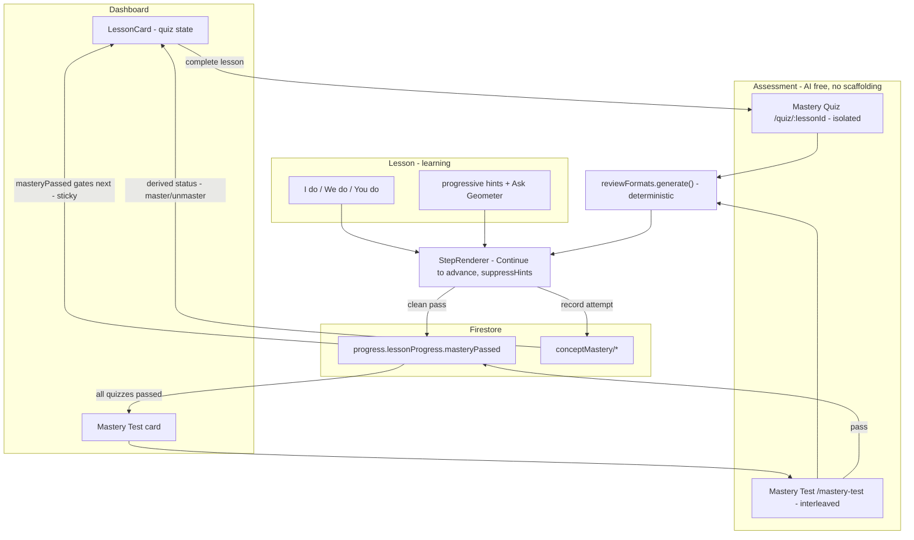

# Geometer — Phase 3 PRD (Learning Science)

## Vision

Phases 1 and 2 shipped a hand-built, learn-by-doing geometry course (8 lessons, I do / We do / You do) plus a personalized, AI-enhanced **Daily Review** that interleaves concepts with spaced retrieval. The teaching works; the techniques are present but blunt.

Phase 3 **sharpens the five learning-science techniques already in the app** rather than adding new buzzwords. The single biggest structural change: **mastery is no longer earned by grinding the same lesson over and over.** Instead, each lesson is followed by a short, isolated **Mastery Quiz** built from fresh, randomly generated numbers (reusing the Phase 2 review formats), and the whole course ends with a comprehensive, interleaved **Mastery Test**. Along the way we fix the one piece of feedback that learners literally never see — the correct-answer message that auto-advances off screen.

**The five techniques and what changes:**

- **Mastery learning** — Replace the implicit "redo the lesson to master it" loop with an explicit, per-lesson **Mastery Quiz** that tests every concept in the lesson on *new numbers*. Passing the quiz is the mastery signal and the gate to the next lesson. A final **Mastery Test** combines all concepts.
- **Scaffolding & desirable difficulty** — Keep the I do / We do / You do gradual-release and the struggle-gated hints **inside lessons only**. Mastery Quizzes and the Mastery Test are pure assessment: no demos, no guided walkthroughs, no progressive hints, no Ask Geometer.
- **Interleaving & combining concepts** — Keep the **Daily Review** as the interleaving engine (mixed concepts across lessons). Make **Mastery Quizzes deliberately isolated** (one lesson, its concepts only), and make the **Mastery Test** the big interleaved finale that mixes every concept in the course.
- **Immediate, explanatory feedback** — Replace the 1200ms auto-advance on correct answers with an **explicit Continue button** so learners actually read the explanation. Applies everywhere the shared renderer runs (lessons, review, quizzes, test).
- **Retrieval practice & spaced repetition** — Already delivered by the Daily Review (fresh numbers force recall; selection is mastery- and recency-weighted). Phase 3 reinforces retrieval by making *graded, number-fresh quizzes* the unlock mechanism instead of recognition-style lesson replays.

**Phase 3 hard rules (from `outline.txt`):**

- The app must keep teaching with **AI turned off**. Mastery Quizzes and the Mastery Test are **100% deterministic and AI-free** (they reuse the deterministic generators and ground-truth solvers from `reviewFormats.ts`; no reskinning, no AI hints).
- No regressions to Phase 1 lessons or Phase 2 review, streaks, or leaderboard.

---

## Why This Design

- **Mastery learning requires a clear mastery signal *before* unlocking the next concept** (`outline.txt` line 97). Today the next lesson unlocks on mere completion (`isLessonLocked` in [src/services/progressService.ts](src/services/progressService.ts) only checks `requires.completed`), and "mastery" is a soft last-2-correctness badge that the user can farm by replaying a lesson. A graded, fresh-number quiz is a real, un-farmable signal: you cannot pass it by memorizing the one set of numbers in the lesson.
- **Retrieval practice beats recognition** (`outline.txt` line 94). Re-running a lesson lets the learner recognize the same figures and numbers. A quiz on *new* numbers forces them to pull the method out of memory.
- **Interleaving belongs at review/test time, not at first learning** (`outline.txt` line 96). When first acquiring a skill, blocked practice on one concept is appropriate — so Mastery Quizzes stay isolated per lesson. Interleaving (mixing concepts so the learner must *choose* the method) is most valuable for consolidation, so it lives in the Daily Review and the comprehensive Mastery Test.
- **Desirable difficulty means fading support, not removing it during learning** (`outline.txt` line 98). The I do / We do / You do arc and progressive hints are the support; they belong in lessons. An assessment with the scaffolding still on isn't an assessment — so quizzes/test drop the support entirely.
- **Explanatory feedback only teaches if it's read** (`outline.txt` line 99). The current correct-answer path (`finishStep` → `setTimeout(onCorrect, 1200)` in [src/components/lesson/StepRenderer.tsx](src/components/lesson/StepRenderer.tsx) line 97-103) destroys the step ~1.2s later via `key={index}` remount, so the explanation flashes and vanishes. An explicit Continue keeps it on screen until the learner chooses to move on.

---

## Persona and User Stories

Same persona as Phases 1-2 (8th graders, hands-on, self-paced).

- As **Jill**, who used to replay a lesson five times to get the "mastered" badge, I want a short quiz on new numbers so mastery means I actually learned the method, not the answer key.
- As **Johnny**, I want each lesson to end with a quick check I can pass (or retake with fresh numbers) so I know I'm ready for the next one.
- As **Sally**, who is ahead, I want a final **Mastery Test** that mixes everything so I can prove I've mastered the whole course.
- As **Devon**, who answers fast, I want to actually *see why my answer was right or wrong* before the next question appears, instead of it jumping ahead.
- As **Maria**, I want lessons to keep their step-by-step help, but I don't want hand-holding during the quiz — that's where I prove I can do it alone.
- As **Robert**, I want to replay any finished lesson as many times as I like just to review, without it changing my mastery or locking anything.
- As **Priya**, I want my Daily Review to actually count: if I keep missing a skill it should stop showing as mastered, and if I nail it again it should go back to mastered — without re-locking lessons I've already opened.

---

## What Changes vs Stays (Phase 3 surface)

| Concern | Owner / Behavior |
| --- | --- |
| Lesson teaching (I do / We do / You do, demos, guided, progressive hints, Ask Geometer) | **Unchanged** — stays in lessons only |
| **Lesson replay** | **Unchanged & explicit** — a completed lesson is **always replayable, unlimited times**, purely for review. Replaying never re-locks anything and **does not change mastery** (mastery moves only via quizzes, the test, and the Daily Review) |
| Daily Review (interleaved, spaced, AI reskin + Ask Geometer) | **Unchanged engine** — remains the interleaving + spaced-retrieval engine, and now **explicitly moves mastery both ways**: a correct review answer can re-master a concept, a wrong one un-masters it |
| Mastery status (per concept + derived per lesson) | **Dynamic** — derived from live `conceptMastery` (last-2 rule). A quiz pass sets the lesson's concepts to mastered; the Daily Review raises/lowers them afterward |
| Mastery Quiz access | **New gate** — the quiz is **locked until the lesson is completed**; only then can it be taken |
| Next-lesson unlock gate | **Changed (sticky)** — from "previous lesson `completed`" to "previous lesson's **Mastery Quiz passed at least once**." This gate is **one-way: once unlocked it never re-locks**, even if review later un-masters a concept |
| Per-lesson Mastery Quiz | **New** — isolated to one lesson, deterministic, AI-free, no scaffolding/hints |
| Comprehensive Mastery Test | **New** — all concepts, interleaved, deterministic, AI-free, gated behind all quizzes passed |
| Correct-answer feedback (lessons + review) | **Changed** — explicit **Continue** button replaces 1200ms auto-advance, everywhere `StepRenderer` runs in teaching/review mode |
| Assessment feedback (Mastery Quiz + Test) | **Changed (FR-7)** — **deferred**: each question takes a single submission then advances with no per-question right/wrong feedback, no hint, no Continue, no confetti; all ✓/✗, correct answers, and explanations appear only on the end-of-assessment review screen |
| Assessment integrity (Mastery Quiz + Test) | **New (FR-7)** — a rules-agreement gate before starting, and a **one-sitting lock**: switching tabs, minimizing, or hiding the window (plus refresh/close) **voids** the in-progress attempt (nothing saves) and forces a restart with fresh numbers |
| Question numbers / answers / grading | **Unchanged** — deterministic generators + ground-truth solvers from `reviewFormats.ts` |

---

## Pages and UI

**Dashboard (`/dashboard`).**
- Each `LessonCard` ([src/components/dashboard/LessonCard.tsx](src/components/dashboard/LessonCard.tsx)) gains a mastery state: after completing a lesson, the primary CTA becomes **"Take Mastery Quiz"**; once passed it shows a **Mastered** badge and the next lesson unlocks. Locked lessons read "Pass the previous mastery quiz to unlock."
- A new **Mastery Test card** appears (disabled until all 8 quizzes are passed; "Pass every lesson's mastery quiz to unlock the final test"). When unlocked it links to `/mastery-test`; when passed it shows a course-completion milestone.

**Mastery Quiz (full-screen, outside the tab bar) — new route `/quiz/:lessonId`.**
A new `MasteryQuizPage` (modeled on [src/pages/ReviewPage.tsx](src/pages/ReviewPage.tsx) but stripped of AI):
- Generates **one fresh question per concept in that lesson** (the lesson's `reviewFormats`), isolated to the single lesson.
- Renders each through the shared `StepRenderer` in **assessment mode** (hints suppressed, no Ask Geometer, and deferred feedback — see FR-7).
- Opens with a **rules-agreement gate** (one sitting, no leaving); each question takes a **single submission** then advances with **no per-question feedback**.
- Ends on a **Results screen**: pass/fail and a **scroll-through review** of every question (per-concept ✓/✗, the learner's answer, the correct answer, and the explanation), then either "Next lesson unlocked" (on pass) or "Retake quiz" with **fresh numbers** (on fail). Retake is always available.

**Mastery Test (full-screen) — new route `/mastery-test`.**
A `MasteryTestPage` that builds **one question per concept across all 8 lessons**, **interleaved** (consecutive questions from different lessons where possible), same AI-free / no-scaffolding rules, and the same FR-7 lock (rules gate, one-sitting void, deferred feedback). Results screen reports overall pass and a scroll-through review of every question, and on pass marks the course mastered.

**No Account changes.** Interests (Phase 2) are untouched.

---

## Functional Requirements

FRs are ordered by build priority. Each is a checkpoint: complete it, verify acceptance criteria, then move on. FR-1 (feedback) is independently shippable and improves every existing surface; FR-2 → FR-5 build the mastery-quiz/test system.

---

### FR-1: Explanatory Feedback — Replace Auto-Advance with Continue (Priority 1)

**Goal:** Make correct-answer feedback impossible to miss by requiring an explicit advance, across every surface that uses the shared renderer.

**Scope:**
- In [src/components/lesson/StepRenderer.tsx](src/components/lesson/StepRenderer.tsx), change `finishStep` (lines 96-103) so that on a correct final answer it shows the feedback + confetti and renders a **Continue** button that calls `onCorrect` on tap, instead of `setTimeout(onCorrect, CELEBRATE_MS)`.
- Apply the same change to the other step components that own their own auto-advance timer: `GuidedStep.tsx` (line ~70), `GridCheckStep.tsx` (~59), `DistanceProblemStep.tsx` (~93), `TransformStep.tsx` (~53), `ShapeMatchStep.tsx` (~1400ms). Multi-part intermediate transitions (e.g. part A → part B) may keep their brief celebrate, but the **final** correct answer of each step requires Continue.
- This is intentionally global: lessons, Daily Review (`ReviewPage` advances on `onCorrect` via `key={index}` remount), Mastery Quiz, and Mastery Test all benefit with no per-surface code.
- Add a `.continue-btn` style in [src/styles/global.css](src/styles/global.css); ensure it's reachable/visible on mobile without scrolling past the feedback.

**Out of scope:** Wrong-answer behavior (already stays on screen until retried); changing feedback *text*.

**Acceptance criteria:**
- A correct answer shows the explanation and stays on screen until the learner taps **Continue**; nothing auto-advances.
- Wrong answers behave exactly as before (feedback persists, learner retries).
- Daily Review still advances correctly (one question per Continue) and still persists/saves session state on advance.
- Confetti/celebration still plays.

> **Checkpoint:** Verify in a Phase 1 lesson and in the Daily Review before FR-2.

---

### FR-2: Mastery Quiz Generation — Isolated, Deterministic, AI-Free (Priority 2)

**Goal:** Build a per-lesson quiz from fresh random numbers covering exactly that lesson's concepts, with no AI and no scaffolding.

**Scope:**
- New service `src/services/masteryQuizService.ts`. Reuse the existing catalog: `REVIEW_FORMATS` and `getFormatForStep` from [src/content/reviewFormats.ts](src/content/reviewFormats.ts), and the concept registry in [src/content/concepts.ts](src/content/concepts.ts).
- `buildMasteryQuiz(lessonId)`: select **all** `REVIEW_FORMATS` where `format.lessonId === lessonId` (one question per concept in the lesson; isolated — no other lesson's formats), call `format.generate()` to produce fresh numbers, and return an ordered list of `GeneratedQuestion`. No interleaving (single lesson by definition).
- **Pass logic:** `isMasteryQuizPassed(results)` = every concept answered correctly **on the first try** (clean: no wrong attempt, no hint). Reuse the `QuestionFlags` / `isSessionQuestionCorrect` model from [src/services/reviewSession.ts](src/services/reviewSession.ts).
- Quizzes are **stateless across attempts**: each retake calls `format.generate()` again for new numbers. (Optional: persist an in-progress quiz to `localStorage` like `reviewSessionStore.ts` so a refresh resumes; not required for pass/fail correctness.)

**Out of scope:** UI, gating, persistence of pass state (FR-3/FR-4), the Mastery Test (FR-5).

**Acceptance criteria:**
- `buildMasteryQuiz(lessonId)` returns exactly one question per concept of that lesson and nothing from other lessons.
- Every generated question has a ground-truth integer answer that grades correctly through `StepRenderer` (covered by Vitest, mirroring `reviewFormats.test.ts` across many seeds).
- `isMasteryQuizPassed` returns true only when all concepts are clean-correct.

> **Checkpoint:** Unit-test generation + pass logic before wiring UI.

---

### FR-3: Mastery Quiz Page + Suppressed Scaffolding (Priority 3)

**Goal:** Ship the playable per-lesson quiz with assessment-mode rendering (no hints, no Ask Geometer, no demos/guided), reachable only after the lesson is completed.

**Scope:**
- **Access gate (hard rule):** the Mastery Quiz for a lesson is **locked until that lesson is completed** (`getLessonProgress(progress, lessonId).completed === true`). Before completion the dashboard hides/disables the "Take Mastery Quiz" CTA ("Finish the lesson to unlock its quiz"), and the `/quiz/:lessonId` route redirects to the dashboard if the lesson is not yet completed (mirroring the existing locked-lesson redirect in `LessonView.tsx`).
- Add `suppressHints?: boolean` to `StepRenderer` props. When true, `handleWrong` shows the plain `feedback.wrong` and **never escalates to `feedback.hint`** (removes the desirable-difficulty support that belongs only in lessons). Default false preserves Phase 1/2 behavior.
- New page `src/pages/MasteryQuizPage.tsx` + route `/quiz/:lessonId` in [src/App.tsx](src/App.tsx) (full-screen, auth-gated, outside the tab bar, like `/review`). It:
  - Calls `buildMasteryQuiz(lessonId)`, renders each question via `StepRenderer` with `suppressHints` and **without** the Ask Geometer affordance (omit the `review-hint` block entirely — no AI calls of any kind).
  - Tracks per-question `QuestionFlags`; advances on Continue (FR-1).
  - Shows a **Results screen**: pass/fail headline, per-concept ✓/✗, and a CTA — on pass, "Continue to next lesson" (deep-link to the unlocked lesson); on fail, "Retake quiz" (rebuilds with fresh numbers) plus a "Revisit lesson" link.
- Records mastery outcomes to Firestore using the existing `recordConceptAttempt` per concept (so quizzes still feed the Daily Review's spaced-retrieval signal).

**Out of scope:** Changing the unlock gate (FR-4), Mastery Test (FR-5).

**Acceptance criteria:**
- The quiz is unreachable until the lesson is completed (CTA hidden/disabled and route redirects).
- The quiz shows no demonstration/guided steps, no progressive hints, and no Ask Geometer.
- Passing requires all concepts clean-correct; failing offers a retake with different numbers.
- Each answered concept writes a `conceptMastery` attempt.
- Works on mobile; works with AI fully disabled.

> **Checkpoint:** Pass and fail a quiz end-to-end before changing gating.

---

### FR-4: Mastery Gating + Dynamic Mastery Status (Priority 4)

**Goal:** Make passing the Mastery Quiz the gate to the next lesson, while keeping mastery **status** dynamic so the Daily Review can master and un-master skills over time. Two distinct concepts, deliberately decoupled:

- **Unlock gate (sticky, one-way):** has the learner *ever* passed this lesson's Mastery Quiz? Drives whether the next lesson is accessible. Once true it **never reverts**, so learners are never re-locked by later review slips.
- **Mastery status (dynamic, two-way):** is the lesson *currently* mastered? Derived live from per-concept `conceptMastery` (the last-2 rule). Drives the "Mastered" badge and review prioritization, and **moves up and down with Daily Review performance**.

**Scope:**

- Extend `LessonProgress` in [src/types/progress.ts](src/types/progress.ts):

```ts
interface LessonProgress {
  currentStep: number;
  completed: boolean;
  masteryPassed?: boolean;     // STICKY unlock gate: quiz passed at least once
  masteryPassedAt?: number;    // epoch ms of first pass (for milestones)
  legacyCompleted?: boolean;   // back-compat: pre-Phase-3 completion satisfies the gate, but is not a quiz pass
}
```

- Add `recordMasteryQuizResult(uid, lessonId, passed)` to [src/services/progressService.ts](src/services/progressService.ts) (merge-write, mirroring `updateLessonProgress`). On a pass it (a) sets the sticky `masteryPassed`/`masteryPassedAt` and (b) counts as daily activity (streak bump + leaderboard mirror via `recordLessonActivity`, in one combined write so the streak stays stable). A fail is a no-op; `masteryPassed` is **never set back to false** by review. Concept mastery is **not force-written here** — instead the quiz page records one clean `recordConceptAttempt` per concept, so under the last-2 rule a freshly-passed concept moves to `learning` and needs a second correct answer (a Daily Review or a retake) to reach `mastered`. This keeps `conceptMastery` an honest record of actual answers rather than a side effect of passing.
- Change `isLessonLocked` to gate on a **sticky prerequisite check** (`isPrereqSatisfied`) rather than on completion. The prerequisite unlocks the next lesson when the learner has either (a) passed its Mastery Quiz (`masteryPassed`), (b) a pre-Phase-3 completion back-filled as `legacyCompleted`, or (c) completed it while still un-migrated (a race window so legacy learners aren't momentarily re-locked before the migration write lands). It is one-way: once unlocked it never re-locks.

```ts
function isPrereqSatisfied(progress, lessonId) {
  const lp = getLessonProgress(progress, lessonId);
  if (lp.masteryPassed === true) return true;          // the real Phase 3 gate
  if (lp.legacyCompleted === true) return true;        // pre-Phase-3 completion
  if (!progress.v3Migrated && lp.completed === true) return true; // migration race window
  return false;
}

export function isLessonLocked(progress, requires?) {
  if (!requires) return false;
  return !isPrereqSatisfied(progress, requires); // sticky; never re-locks
}
```

- Add a derived helper `lessonMasteryStatus(conceptMastery, lessonId): 'mastered' | 'in-progress' | 'needs-review'` = aggregate of the lesson's concept levels (all `mastered` → mastered; any `need-review` → needs-review; else in-progress). This is **display/recommendation only** — it does not affect `isLessonLocked`.
- Update `getLessonButtonState` and `LessonCard` to surface the flow using **both** signals:
  - `Locked` when the prerequisite's `masteryPassed` is false.
  - `Start` → `Continue` while in progress.
  - On `completed` but not yet `masteryPassed`: **`Take Mastery Quiz`**.
  - On `masteryPassed`: **`Review`** (lesson always replayable) plus a **dynamic mastery chip** from `lessonMasteryStatus` ("Mastered" / "Review recommended"). If review has knocked the status below mastered, the card invites a refresh (replay the lesson and/or retake the quiz) but the next lesson stays unlocked.
- **Lesson replay is unlimited and side-effect-free for mastery:** a `completed` lesson is always replayable for review; replaying changes neither the unlock gate nor mastery. Remove the `recordLessonCompletionAttempts` mastery write from `LessonView.tsx` so finishing/replaying a lesson no longer writes mastery. (Lesson completion still sets `completed: true` and unlocks that lesson's own quiz.) Mastery now moves **only** via the Mastery Quiz, the Mastery Test, and the Daily Review.
- **Daily Review moves mastery both ways (already wired, made explicit):** review already writes one `conceptMastery` attempt per question via `recordConceptAttempt` (correct → pushes `true`, struggled → pushes `false`), and the last-2 rule means a wrong review answer **un-masters** the concept (and its lesson's derived status) while later correct answers **re-master** it. No new write path is needed; FR-4 just surfaces this in the dashboard chip and confirms it in tests. (The sticky unlock gate is intentionally unaffected.)
- Update [firestore.rules](firestore.rules) `progress` validation to allow the new top-level `masteryTestPassed` / `masteryTestPassedAt` / `v3Migrated` fields (the per-lesson `masteryPassed` / `masteryPassedAt` / `legacyCompleted` ride inside the already-permitted `lessonProgress` map).
- Migration/back-compat: existing users have `completed` lessons but no `masteryPassed`. **Approach:** a one-time, persisted migration (`migrateProgressV3` / `runV3MigrationIfNeeded`) marks every already-`completed` lesson as `legacyCompleted` and sets a `v3Migrated` flag. `legacyCompleted` satisfies the unlock gate (so current learners are never re-locked) **without** counting as a quiz pass — so legacy learners are still offered the Mastery Quiz on lessons they had already finished. A fresh, post-migration completion does **not** auto-unlock the next lesson; the learner must pass the quiz.

**Out of scope:** The Mastery Test (FR-5).

**Acceptance criteria:**
- Completing a lesson unlocks its quiz but **not** the next lesson; passing the quiz unlocks the next lesson and shows the lesson as Mastered.
- A completed lesson can be replayed unlimited times; replaying changes neither the unlock gate nor any mastery signal.
- After a lesson is mastered, getting its concept **wrong in the Daily Review** drops the lesson's dynamic mastery status (un-masters it) but does **not** re-lock the next lesson; getting it **right** in review restores mastered status without a re-quiz.
- Dashboard reflects Start / Continue / Take Mastery Quiz / Review, plus a dynamic Mastered / Review-recommended chip.
- Firestore rules accept the new fields and reject other-user writes; existing learners are not re-locked.

> **Checkpoint:** Walk a fresh account through lesson → quiz → next lesson; replay a lesson and confirm no mastery change; miss a mastered concept in review and confirm the chip un-masters while the next lesson stays unlocked.

---

### FR-5: Comprehensive Mastery Test — Interleaved Finale (Priority 5)

**Goal:** A single end-of-course test that mixes every concept, proving whole-course mastery.

**Scope:**
- `buildMasteryTest()` in `masteryQuizService.ts`: generate **one fresh question per concept across all 8 lessons** (all `REVIEW_FORMATS`), then **interleave** so consecutive questions come from different lessons where possible (a small ordering helper — round-robin by `lessonId` — since today's review order is deterministic by score then `formatId`, not shuffled).
- New page `src/pages/MasteryTestPage.tsx` + route `/mastery-test`. Same assessment rules as the quiz (no scaffolding, no AI, Continue-to-advance). Pass criteria: a course-level threshold (default **all concepts clean-correct**; configurable to a percentage if all-or-nothing proves too harsh — note this as a tunable).
- Course-level pass state: add `masteryTestPassed?: boolean` (+ `at`) to `UserProgress` and `recordMasteryTestResult`. On pass, show a **course-completion milestone** on the dashboard (and optionally a leaderboard/profile badge — reuse the existing milestone/streak surfaces).
- **Mastery Test card** on the dashboard, gated: disabled until **every** in-scope lesson has `masteryPassed === true`; links to `/mastery-test` when unlocked.

**Out of scope:** Certificates/export, new AI features.

**Acceptance criteria:**
- The test includes exactly one question per concept across all lessons and presents them interleaved (not grouped by lesson).
- The test card is locked until all per-lesson quizzes are passed.
- Passing marks `masteryTestPassed` and surfaces the milestone; the AI-off path works.

> **Checkpoint:** Pass all quizzes, take the test, confirm the milestone.

---

### FR-6: Testing, Mobile, and Deployment (Priority 6)

**Goal:** Lock in Phase 1/2 guarantees and verify the new flows on the deployed app.

**Scope:**
- Vitest: `buildMasteryQuiz` (one-per-concept, single-lesson isolation), `buildMasteryTest` (full coverage + interleaving ordering), pass logic, the new **sticky** `isLessonLocked` gate (never re-locks), `lessonMasteryStatus` derivation (master/un-master from concept levels), the quiz-locked-until-completed rule, the back-compat shim, and `suppressHints` behavior.
- Manual: Continue-button feedback on lessons + review; **unlimited lesson replay with no mastery change and no re-lock**; quiz locked until completion; quiz pass/fail/retake; **miss a mastered concept in the Daily Review → lesson un-masters but next lesson stays unlocked → answer it right later → re-masters**; gating with a fresh and a legacy account; the full test + milestone; everything on phone-sized viewports; everything with AI disabled.
- Deploy to the existing Firebase Hosting target.

**Acceptance criteria:**
- All new unit tests pass; no regression in Phase 1 lessons, Phase 2 review, streaks, or leaderboard.
- Quizzes and test run fully with AI off; feedback requires Continue everywhere.
- Mobile-correct; deployed.

> **Checkpoint:** Phase 3 complete.

---

### FR-7: Locked-In Assessment Mode — One Sitting, Deferred Feedback (Priority 7)

**Goal:** Make the Mastery Quiz and Mastery Test a true, un-gameable evaluation of a learner's *unaided* best effort: completed in one sitting, with no distractions or hints from feedback, and with right/wrong revealed only at the very end.

**Why:** Per-question feedback during an assessment leaks hints (a "wrong" message tells the learner to try again before the result is recorded) and invites the learner to pause, switch tabs, and look things up. Deferring all feedback to the end keeps the learner locked in, removes the mid-test hint signal, and makes the score reflect their first, unaided attempt. This complements FR-1 (Continue-to-advance feedback) which stays the behavior in **lessons and Daily Review only**; assessments are deliberately different.

**Scope:**

- **Assessment-mode rendering.** Add `assessmentMode?: boolean` to [src/components/lesson/StepRenderer.tsx](src/components/lesson/StepRenderer.tsx) (implies `suppressHints`). When true, a question takes a **single submission** and then advances immediately with **no** correct/wrong message, **no** hint, **no** Continue button, **no** confetti, and **no** answer reveal in the figure. Correctness is still reported through the existing `onAttempt(correct, value)` hook, so grading is unchanged. The two multi-part review shapes (`leg-then-perimeter`, `multi-part-numeric`) advance through their parts on a single submission each, recording every part's correctness (a question is clean-correct only if every part was right). The correct intermediate value (e.g. the missing leg) **is** revealed in the figure after each part, so a learner who misses one step still gets a fair attempt at the later step. Mirror the same single-submission, no-feedback behavior in [src/components/lesson/DistanceProblemStep.tsx](src/components/lesson/DistanceProblemStep.tsx) (recording every subStep, skipping the car journey).
- **Rules-agreement gate.** Before the first question, both assessment pages show a short rules screen the learner must acknowledge: must finish in one sitting; do not leave, switch tabs, or minimize; leaving voids the attempt and saves nothing; you'll review what you got right and wrong only at the end.
- **One-sitting lock (strict).** While an attempt is active, a shared `useAssessmentGuard` hook installs listeners that **void** the attempt on `visibilitychange` (hidden), window `blur`, and warns on refresh/close (`beforeunload`). A voided attempt records nothing (it never reaches the end-of-assessment write path) and shows a "your attempt ended" screen offering a **restart with fresh numbers**. The in-app "← Dashboard" link is hidden while active (in-app navigation away simply abandons the attempt, which already saves nothing).
- **End-of-assessment review.** After the final question, a scrollable review (`AssessmentReview`) lists **every** question with its concept label, ✓/✗, the prompt, the learner's answer, the correct answer, and the worked explanation — for multi-step problems this includes a worked line for **every step**, not just the final answer. Pass/fail logic and the Firestore writes (`recordConceptAttempt` per concept + `recordMasteryQuizResult`/`recordMasteryTestResult` on pass, with the streak bump) are unchanged and still run **only** at the end of a non-voided attempt.

**Out of scope:** Changing FR-1 behavior in lessons/Daily Review; changing pass criteria, gating, or generators.

**Acceptance criteria:**
- A Mastery Quiz/Test cannot start until the learner acknowledges the rules.
- During an attempt, switching tabs / minimizing / hiding the window (or refreshing/closing) voids the attempt: nothing is written and the learner must restart with fresh numbers.
- No per-question right/wrong feedback, hint, confetti, or Continue appears during an assessment; each question advances on a single submission.
- The end screen shows a scroll-through of every question with ✓/✗, the learner's answer, the correct answer, and the explanation.
- Lessons and the Daily Review still show FR-1 Continue-to-advance feedback (no regression). Grading, pass logic, gating, and AI-off guarantees are unchanged.

> **Checkpoint:** Acknowledge the rules, switch tabs mid-quiz and confirm the attempt voids with no save, then complete a quiz in one sitting and review every question at the end.

---

## Data Model and Schemas

**Progress (`users/{uid}/data/progress`) — additive:**

```ts
interface LessonProgress {
  currentStep: number;
  completed: boolean;
  masteryPassed?: boolean;     // Phase 3 — STICKY unlock gate (quiz passed at least once; never reverts)
  masteryPassedAt?: number;    // Phase 3
  legacyCompleted?: boolean;   // Phase 3 — back-compat: pre-Phase-3 completion; satisfies the unlock gate WITHOUT counting as a quiz pass
}

interface UserProgress {
  lessonProgress: Record<string, LessonProgress>;
  streak?: number;
  lastActivityDate?: string;
  masteryTestPassed?: boolean;   // Phase 3 — passing the comprehensive test
  masteryTestPassedAt?: number;  // Phase 3
  v3Migrated?: boolean;          // Phase 3 — one-time back-compat migration has run for this learner
}
```

**Concept mastery (`users/{uid}/conceptMastery/{lessonId__stepId}`):** unchanged shape; written by Mastery Quiz / Test attempts and by the Daily Review via the existing `recordConceptAttempt`. This is the single source of truth for the **dynamic** mastery status (last-2 rule), so the Daily Review naturally masters/un-masters concepts. The **sticky** unlock gate lives separately in `LessonProgress.masteryPassed` and is never moved by review.

**No new collections.** Mastery Quizzes and the Mastery Test reuse the Phase 2 `reviewFormats.ts` generators and `StepRenderer` rendering/grading — only a new service, two pages, a renderer prop, and progress fields.



---

## Technical Stack (additions to Phases 1-2)

| Layer | Phase 3 addition |
| --- | --- |
| Assessment logic | `src/services/masteryQuizService.ts` — `buildMasteryQuiz`, `buildMasteryTest`, interleave helper, pass logic (reuses `reviewFormats.ts` + `reviewSession.ts`) |
| Routes/pages | `/quiz/:lessonId` (`MasteryQuizPage`), `/mastery-test` (`MasteryTestPage`) |
| Renderer | `StepRenderer` — Continue button (replaces auto-advance) + `suppressHints` flag |
| Persistence | `LessonProgress.masteryPassed` + `UserProgress.masteryTestPassed`; `firestore.rules` updated |
| AI | **None.** Mastery Quizzes and the Mastery Test make no model calls |

Everything else (React 19, Vite, React Router 7, Firestore, Konva, KaTeX, Vitest, Firebase Hosting, the Phase 2 AI review path) is unchanged.

---

## Open Defaults (decided; flag in review if you disagree)

- **Mastery gating is ON and sticky** (passing a lesson's quiz unlocks the next lesson; once unlocked it never re-locks). Alternative kept simple to flip: gate only the final Mastery Test behind quizzes while lessons unlock on completion.
- **Unlock gate and mastery status are decoupled:** the gate is sticky (`masteryPassed`); the "Mastered" status is dynamic (derived from `conceptMastery`) so the Daily Review masters/un-masters skills. The user requirement "review affects mastery both ways" is satisfied by the dynamic status, deliberately *without* letting review re-lock lessons.
- **Lessons are replayable without limit** for review; replaying never changes mastery or locks.
- **Pass = all concepts clean-correct on the first try**, retake with fresh numbers. Alternative: a percentage threshold.
- **Continue button applies everywhere** (lessons + review + quizzes + test). Alternative: lessons only.
- **Legacy `completed` lessons are back-filled as `legacyCompleted`** (via a one-time `v3Migrated` migration) so current learners aren't re-locked — but they are still offered the Mastery Quiz, since `legacyCompleted` satisfies the unlock gate without counting as a quiz pass.
